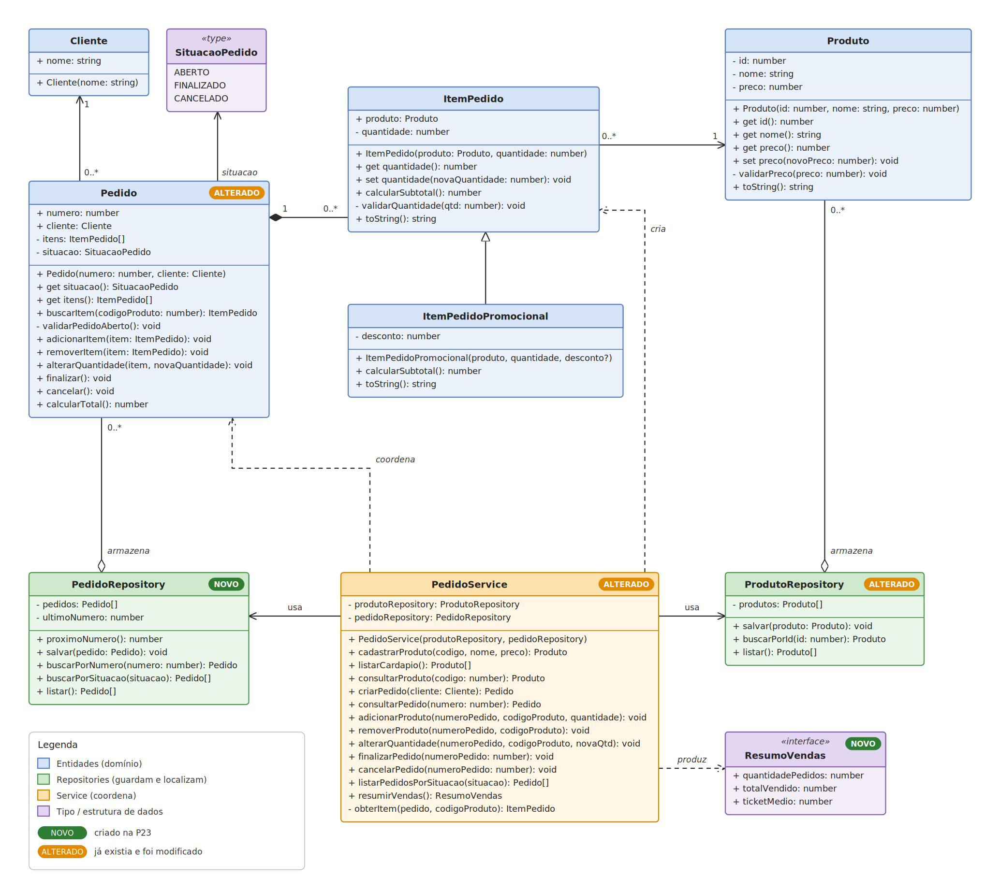

   

## P23 - Repositories e persistência em memória

- Diagrama de classes atualizado: [docs/diagrama-de-classes.md](docs/diagrama-de-classes.md)
- Executar as demonstrações HU01 a HU10: `npm start`
- Verificar tipos: `npm run check`

