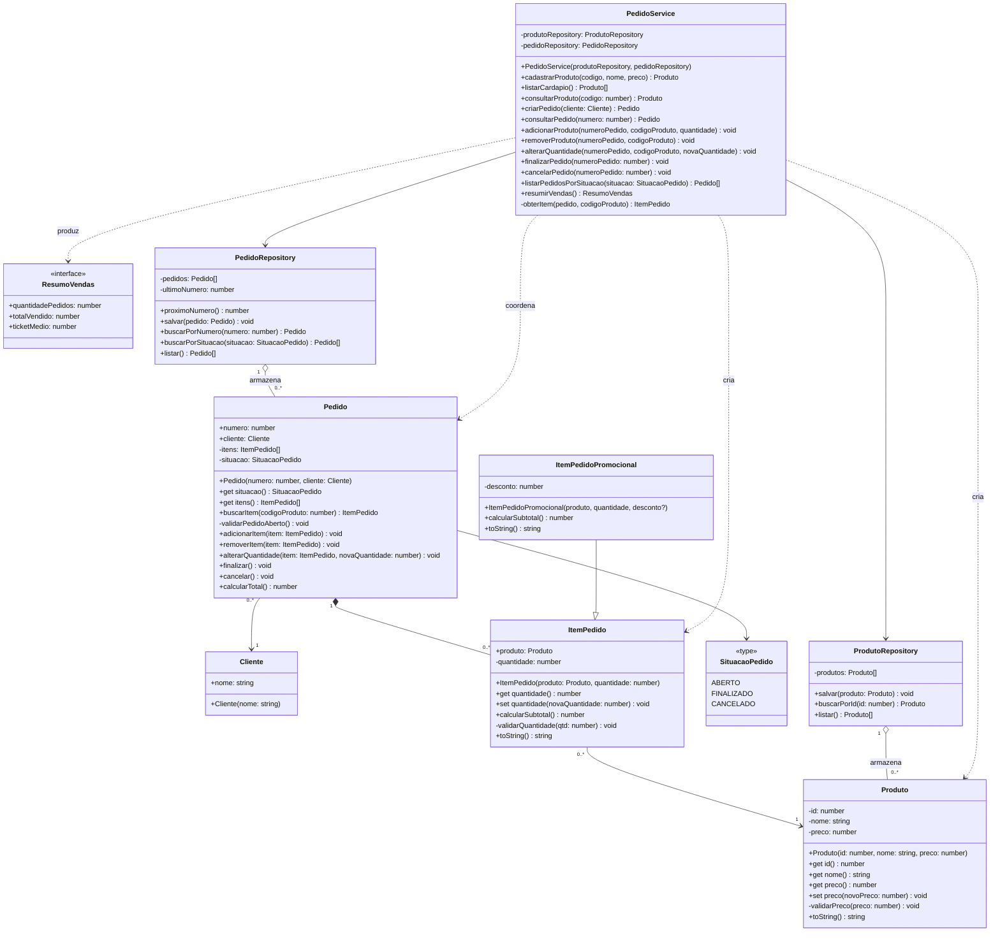

# Diagrama de classes - P23 (Repositories e persistência em memória)

## Distribuição de responsabilidades

| Camada | Classe | Responsabilidade |
|---|---|---|
| Entidade | `Pedido` | Regras de situação (só altera se ABERTO), total, localizar o próprio item por código de produto |
| Entidade | `ItemPedido` | Valida quantidade, calcula subtotal |
| Entidade | `Produto` | Valida preço |
| Repository | `ProdutoRepository` | Guarda e localiza produtos (coleção privada) |
| Repository | `PedidoRepository` | Guarda e localiza pedidos, gera o número sequencial (coleção privada) |
| Service | `PedidoService` | Coordena cada história: busca via repositories, rejeita código inexistente/duplicado, delega regras às entidades, monta o `ResumoVendas` |

Regra de código duplicado (HU06) e de pedido/produto inexistente (HU08) ficam no Service, não no Repository, que apenas armazena e localiza.
